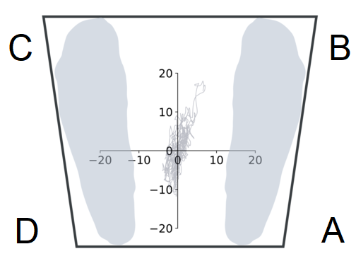

# Directional Virtual Time-to-Contact: A New Measure for Investigating Temporal, Spatial, and Control Aspects of Postural Balance Control

This repository contains the implementation of customized functions for directional virtual time-to-contact (VTC). We support both MATLAB (see `code_matlab` folder) and Python (see `code_python` folder) users. Sample data are also included. You can preserve the same directory tree (below) to directly run the code in your local machine:

```
$ Directory tree
.
├── code_python\
│   ├── main.py
│   ├── visualizer.py
│   └── vtc_utils.py
├── code_matlab\
│   ├── get_vtc.m
│   ├── get_vtc_outcomes.m
│   ├── get_vtc_series.m
│   └── main.m
└── data\
    └── sample_cop.csv
```

See [our publication](https://www.sciencedirect.com/science/article/pii/S0021929022004699) on the *Journal of Biomechanics* for more detail of the method and testing scenarios. 

## Importance before Using the Code
We assume that you already did pre-processing steps (e.g., filling missing gaps, filtering, etc.) on your data before using the code. 

## Preparing Your Data
The calculation of directional VTC requires center-of-pressure (CoP) trajectories and base of support (BoS). 

We initially used the net CoP for calculation but it should work for CoP under each foot too. 

The BoS can be either measured by a marker-based motion capture system or other means. We use a trapezoid (or its special case, a rectangle) fitting participant's feet as the BoS. Future updates will address more complex shapes of the BoS or use functional limit of stability for the VTC calculation.

<p align="center">
  
</p>

<p align="center">
  An example of the CoP and BoS
</p>

## Using the MATLAB Code
*(See this if you are using MATLAB for your analysis)*

```python
clear
close all
clc

% Constants
IDX = 2;
IDY = 3;
fs = 2000; % Hz

% Boundary
% YOU NEED TO MEASURES BOS OF YOUR PARTICIPANT AND ENTER IT HERE -->
bos   = struct();
bos.A = [10, -10];
bos.B = [15, 20];
bos.C = [-15, 20];
bos.D = [-10, -10];
% <-- YOU NEED TO MEASURES BOS OF YOUR PARTICIPANT AND ENTER IT HERE

% Get CoP data
dt = readmatrix("../data/sample_cop.csv");

cop   = struct();
cop.x = dt(:, IDX);
cop.y = dt(:, IDY);

% Obtain VTC time-series
[vtc_s, bc_s] = get_vtc_series(cop, bos, fs);

% Calculate directional VTC outcomes
[outcomes] = get_vtc_outcomes(vtc_s, bc_s, fs);

fprintf("2D VTC mean = %.2f (s)\n", outcomes(1));
fprintf("AP VTC mean = %.2f (s)\n", outcomes(2));
fprintf("ML VTC mean = %.2f (s)\n", outcomes(3));
fprintf("AP BC = %.2f (percents) \n", outcomes(4));
fprintf("ML BC = %.2f (percents) \n", outcomes(5));
fprintf("Switching rate = %.2f (Hz)\n", outcomes(6));
```

You may add your self-defined threshold as the 4th parameter in `get_vtc_outcomes`, for example, `get_vtc_outcomes(vtc_s, bc_s, fs, 5)`.


## Using the Python Code
*(See this if you are using Python for your analysis)*

```python
import pandas as pd 
import numpy as np 

from easydict import EasyDict
from vtc_utils import *
import visualizer


# Constants
fs = 2000 # Hz

# Boundary
# YOU NEED TO MEASURE BOS OF YOUR PARTICIPANT AND ENTER IT HERE -->
bos   = EasyDict()
bos.A = [10, -10]
bos.B = [15, 20]
bos.C = [-15, 20]
bos.D = [-10, -10]
# <--- YOU NEED TO MEASURE BOS OF YOUR PARTICIPANT AND ENTER IT HERE

# Get CoP data
dt = pd.read_csv('..\\data\\sample_cop.csv')
dt = dt.astype(float)

cop   = EasyDict()
cop.x = dt['COPx'].to_numpy()
cop.y = dt['COPy'].to_numpy()
time  = dt['Time'].to_numpy()

# Obtain VTC time series
vtc_s, bc_s = get_vtc_series(cop, bos, fs)

# Calculate directional VTC outcomes
outcomes = get_vtc_outcomes(vtc_s, bc_s, fs)

print('2D VTC mean = ' + str(round(outcomes[0], 2)) + ' (s)')
print('AP VTC mean = ' + str(round(outcomes[1], 2)) + ' (s)')
print('ML VTC mean = ' + str(round(outcomes[2], 2)) + ' (s)')
print('AP BC = ' + str(round(outcomes[3], 2)) + ' (%)')
print('ML BC = ' + str(round(outcomes[4], 2)) + ' (%)')
print('Switching rate = ' + str(round(outcomes[5], 2)) + ' (Hz)')

# Plot CoP data
visualizer.plot_cop(cop, bos)

# Plot time-series data
visualizer.plot_ts(time[2::], vtc_s, thres = outcomes[-1])
visualizer.plot_ts(time[2::], bc_s)
```

You may add your self-defined threshold as the 4th parameter in `get_vtc_outcomes`, for example, `get_vtc_outcomes(vtc_s, bc_s, fs, sw_thres = 5)`.

## Citation

If you find the code helpful for your work, please consider citing [our paper](https://www.sciencedirect.com/science/article/pii/S0021929022004699):
```
@article{PHAN2023111428,
title = {Directional virtual time-to-contact: A new measure for investigating temporal, spatial, and control aspects of postural balance control},
journal = {Journal of Biomechanics},
volume = {146},
pages = {111428},
year = {2023},
issn = {0021-9290},
doi = {https://doi.org/10.1016/j.jbiomech.2022.111428},
url = {https://www.sciencedirect.com/science/article/pii/S0021929022004699},
author = {Vu Phan and Daniel S. Peterson and Hyunglae Lee},
keywords = {Biomechanics, Standing balance, Postural balance, Postural stability, Balance stability},
abstract = {Virtual time-to-contact (VTC) is a promising approach for investigating postural balance control. However, current VTC calculation approaches are limited as they (1) cannot be used to evaluate directional components of balance, and (2) only assess a single, temporal aspect of balance control. This study introduces a new approach for VTC calculation, namely directional VTC, expanding VTC to assess temporal, spatial, and control aspects of balance. Three case studies were conducted across varying populations and conditions as a proof-of-concept of the presented method. The first study examined quiet stance on a firm surface in people with Parkinson’s disease (PD; n = 10) in comparison to their healthy peers (n = 10). The second and third studies assessed balance control of healthy individuals under challenging environments. Ten healthy individuals participated in standing tasks on compliant ground surfaces, while another ten on oscillatory ground surfaces, all simulated by a dual-axis robotic platform. Preliminary results not only provided a closer look at balance control with multiple aspects, including temporal, spatial, and control aspects, but also showed how different aspects of balance changed due to neurological diseases (Case Study I) or challenging standing grounds (Case Studies II and III). This study advances our understanding of posture biomechanics and its clinical applications.}
}
```

